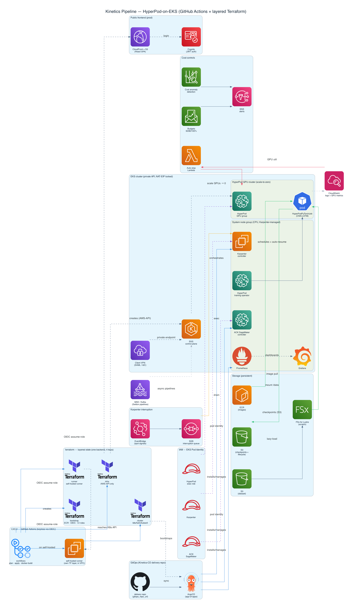

# kinetics-pipeline — HyperPod-on-EKS training infra

Infrastructure for training a video action-recognition model (CNN-LSTM on
Kinetics, with transfer learning) on **SageMaker HyperPod orchestrated by EKS** , with **cost controls built in from day one**.

## Architecture



## Layout

```
terraform/                  # Modular IaC for the whole platform
  modules/
    vpc/                    # VPC, subnets, single NAT (cost), Karpenter tags
    eks/                    # EKS control plane + CPU node group + HyperPod
                            #   training operator (EKS managed add-on)
    iam/                    # HyperPod exec role + Pod Identity roles (ACK, Karpenter)
    karpenter/              # SQS interruption queue + EventBridge rules (Spot-safe)
    storage/                # S3 (data/checkpoints w/ lifecycle) + FSx for Lustre
    hyperpod/               # SageMaker HyperPod cluster (EKS orchestrator)
    cost/                   # Budgets, anomaly detection, auto-stop Lambda
                            #   (Lambda disabled when GPU autoscaling is on)
    mlflow/                 # SageMaker-managed MLflow tracking server +
                            #   artifact bucket (experiment tracking)
    ecr/                    # Container registry (immutable tags; prevent_destroy)
    cicd/                   # GitHub Actions OIDC provider + least-privilege roles
    addons/                 # Bootstrap only: ArgoCD + EKS Pod Identity associations
    client_vpn/             # AWS Client VPN (SAML/IAM Identity Center), private-subnet
                            #   associated, egress via NAT (optional, off by default)
training/                   # PyTorch CNN-LSTM trainer (modular, no notebooks)
  src/kinetics_trainer/     # config, data, model, engine, checkpoint, distributed
    predictor.py            # backend-agnostic Predictor (shared by both serving paths)
    serving/                # FastAPI inference backend (app, metrics, schemas)
  train.py                  # torchrun entrypoint (/workspace/train.py in image)
  inference/inference.py    # SageMaker endpoint handler (delegates to Predictor)
  deploy/                   # package_model.py + deploy_endpoint.py (SageMaker SDK)
  local/                    # docker-compose stack (inference+Prometheus+OTel+Grafana)
  Dockerfile  Dockerfile.serve  requirements.txt  tests/
helm/
  training-job/             # HyperPodPyTorchJob chart: distributed, auto-resume
gitops/                     # Reference GitOps tree. The DEPLOYED source of truth
                            #   ArgoCD reconciles is the separate delivery repo
                            #   (gitops_repo_url) — see "GitOps delivery" below.
  apps/                     # ArgoCD apps: Karpenter, ACK SageMaker, Prometheus,
                            #   DCGM, FSx CSI, job,
                            #   karpenter-nodepools
  karpenter/                # Karpenter NodePool + EC2NodeClass (Spot-first, CPU)
cue/
  schema.cue                # Strict schemas for every manifest kind this repo emits
scripts/
  validate-manifests.sh     # helm render + gitops -> cue vet (strict)
  build-image.sh            # buildx amd64 image -> ECR (or local --load)
  setup_dvc.sh              # init DVC S3 remote for the manifests
  setup-github-ci.sh        # set GitHub vars/secrets for the CI workflows
  stage-data.sh             # sync Kinetics-400 archive bucket -> data bucket
  teardown.sh               # cost-aware destroy (empty S3, unfence ECR, drain nodes)
  scale-gpus.sh             # manual GPU scale (FALLBACK; default is autoscaling)
Makefile                    # make validate / image-* / stage-data / teardown
```

## Provision

```bash
cd terraform
terraform init
terraform apply -var-file=terraform.tfvars.dev   # edit emails/region/budget in that file first
aws eks update-kubeconfig --region <region> --name <cluster>   # from outputs
```

> EKS runs **k8s 1.34** (`kubernetes_version`) — a standard-support release
> ($0.10/hr control plane). Avoid extended-support versions (e.g. 1.30 after
> 2025-07) which bill **$0.60/hr**. Check current standard versions with
> `aws eks describe-cluster-versions`.

Terraform installs **only** ArgoCD plus the EKS Pod Identity associations.
Everything else — Karpenter, ACK SageMaker, Prometheus/Grafana, DCGM,
FSx CSI driver and the training job — is reconciled by ArgoCD from the **GitOps
delivery repo** (`gitops_repo_url`), automatically once that URL is set. (The
HyperPod training operator is an EKS managed add-on in the `eks` module, not a
GitOps app.)

### GitOps delivery: the `Kinetics-Continious-Delivery` repo

GitOps manifests live in a **dedicated delivery repo**
([huzaifa678/Kinetics-Continious-Delivery](https://github.com/huzaifa678/Kinetics-Continious-Delivery),
the default `gitops_repo_url`); ArgoCD watches it, not this repo. The `addons`
module bootstraps a single `app-of-apps` Application pointing at that repo's
**`gitops/bootstrap`** path, which fans out to the whole platform:

```
gitops/
  bootstrap/
    applicationset.yaml     # ApplicationSet: one Application per upstream chart
                            #   under gitops/infra/* and gitops/observability/*.
                            #   Multi-source — source[0] is the upstream chart,
                            #   source[1] is this repo as a $values ref.
    root-apps.yaml          # app-of-apps for the standalone Applications in
                            #   gitops/apps/ (in-repo charts + the training job)
  infra/                    # ACK SageMaker, Karpenter, FSx CSI — chart coords only
  observability/            # kube-prometheus-stack, DCGM exporter — chart coords
  environments/dev/values/  # ALL env-specific values (clusterName, region, queue,
                            #   plus the training job's MLflow + OTel settings)
  config/karpenter/         # in-repo chart: Karpenter NodePool + EC2NodeClass
  apps/                     # standalone Applications: karpenter-config + the
                            #   kinetics-training HyperPodPyTorchJob (MANUAL sync)
```

Why a separate repo: it keeps cluster state (what's actually deployed) decoupled
from the platform source, lets the values overlay (`environments/dev/values/`)
hold every environment-specific knob — including the training job's
`tracking.mlflowTrackingUri` and `observability.otelExporterOtlpEndpoint` — and
keeps the training-job Application on **manual** sync so a git push never
silently launches a GPU run. To target a fork, set `gitops_repo_url` /
`gitops_repo_revision` in `terraform.tfvars`. This repo's own `gitops/` tree is
kept as a reference mirror of the same manifests.

### Cluster admin: EKS access entries (not creator-admin)

The cluster uses `authentication_mode = "API"` (no aws-auth ConfigMap) and the
implicit cluster-creator admin grant is **disabled**. Admin is granted
explicitly via access entries (`AmazonEKSClusterAdminPolicy`) to the principals
in `cluster_admin_principal_arns`.

> ⚠️ Include the IAM role/user that **runs Terraform** in
> `cluster_admin_principal_arns`. With creator-admin off, the Helm/Kubernetes
> providers (ArgoCD bootstrap, app-of-apps) authenticate but get RBAC-denied
> unless that principal has an admin access entry. Add your CI/SSO admin role
> ARN there too.

### Private cluster access: AWS Client VPN (SAML)

The public EKS API endpoint is **locked to the VPC NAT gateway's Elastic IP**
(`cluster_endpoint_public_access_cidrs` in `main.tf`) — i.e. only traffic
egressing through this VPC reaches it. The private endpoint stays enabled, so
the intended way in is the optional **AWS Client VPN** (`client_vpn` module,
`enable_client_vpn = true`):

- **Auth:** SAML federated via **IAM Identity Center** (no client certs; a
  self-signed *server* cert is generated and imported to ACM automatically).
- **Topology:** associated to the **private** subnets, so client egress is the
  NAT EIP and, with the VPC resolver pushed as DNS, the EKS **private** endpoint
  resolves to a private IP. On-VPN `kubectl`/Terraform therefore reach the API
  over the private endpoint; the public allowlist is belt-and-suspenders.
- The EKS cluster security group is opened to the VPN client CIDR on 443.

**Manual prerequisite (not Terraformable):** in IAM Identity Center create a
custom SAML app for AWS Client VPN (ACS URL `http://127.0.0.1:35001`, audience
`urn:amazon:webservices:clientvpn`), download its metadata XML into `terraform/`,
then set `enable_client_vpn = true` and `vpn_saml_metadata_file = "<that file>"`.

> ⚠️ First-apply ordering: the NAT EIP doesn't exist until apply creates it, and
> the ArgoCD bootstrap runs at the end of the *same* apply via the helm/kubernetes
> providers. Run the first `terraform apply` **from on the VPN** (reaches the
> private endpoint), or add the apply host's egress IP to
> `cluster_endpoint_public_access_cidrs`.

### Auth: EKS Pod Identity (not IRSA)

Controllers that need AWS permissions (Karpenter, ACK SageMaker) use **EKS Pod
Identity**, not IRSA. Terraform creates the IAM roles (trusted by
`pods.eks.amazonaws.com`) and an `aws_eks_pod_identity_association` mapping
`(namespace, serviceaccount) -> role`. The Helm charts create their own
ServiceAccounts with no annotations — nothing AWS-specific lives in git. The
`eks-pod-identity-agent` EKS addon (enabled in the `eks` module) injects
credentials at runtime.

> Before syncing, set deployment-specific values in the **delivery repo's**
> environment overlay (`gitops/environments/dev/values/`) and Karpenter config:
> - `environments/dev/values/karpenter.yaml` → `settings.clusterName`
> - `environments/dev/values/ack-sagemaker.yaml` → `aws.region`
> - `config/karpenter/values.yaml` → `nodeRole` (the
>   `<project>-<env>-karpenter-node` role from `terraform output`) and
>   `discoveryTag` (the `karpenter.sh/discovery` value, your cluster name).

## Dataset (Kinetics-400)

The trainer reads clips from `/data/kinetics400/<class>/<clip>.mp4` plus the
`train.csv`/`val.csv` manifests in that dir. `/data` is the **FSx-for-Lustre**
mount; FSx is linked to the **data bucket** (`import_path` +
`auto_import_policy = NEW_CHANGED`) and lazy-loads objects on first read. So the
**S3 data bucket is the source of truth FSx serves**; FSx (`SCRATCH_2`) is an
ephemeral cache destroyed with the stack.

- **Acquire** Kinetics-400 (~450 GB) from the
  [CVDF mirror](https://github.com/cvdfoundation/kinetics-dataset) (direct
  tarballs — avoid scraping dead YouTube links); extract to
  `kinetics400/<class>/<clip>.mp4`.
- **Persist it outside the stack** in a separate **archive bucket**
  (`aws s3 mb s3://<archive> --region us-east-1`) so `terraform destroy` /
  `make teardown` never wipe it (teardown empties the *data* bucket, not the archive).
- **Stage per apply** — `scripts/stage-data.sh`:
  ```bash
  ARCHIVE_BUCKET=<archive> LOCAL_DIR=./kinetics400 ./scripts/stage-data.sh upload  # one-time
  ARCHIVE_BUCKET=<archive> ./scripts/stage-data.sh sync                            # each apply (S3->S3, free)
  ```
- Build/version manifests with `data/build_manifest.py` (DVC tracks the manifests,
  not the video — see [data/README.md](data/README.md)); place them under the same
  `kinetics400/` prefix so they land at `/data/kinetics400/`.

> 💸 Staging is cheap (~$10/mo S3) but **full 30-epoch training ≈ 2–3 days ≈
> $350–700** on-demand `g5.12xlarge` (Spot ~−60%). For an apply→test→destroy loop,
> run a **short job** (`--epochs 1` / capped steps) over the real data, then
> `make teardown`; reserve full training for a deliberate Spot campaign.

## Running a training job (the cost-aware loop)

GPUs default to **scale-to-zero** with **HyperPod managed Karpenter** autoscaling
(`enable_gpu_autoscaling = true`, `gpu_instance_count = 0`): Terraform creates
per-AZ **count-0** GPU instance groups, and Karpenter provisions a GPU node only
when a GPU pod is *pending*, then consolidates back to zero when the run ends. You
pay nothing for GPUs until a job is actually scheduled — no manual scaling step.

```bash
# 0. Stage the dataset into the FSx-backed data bucket (see "Dataset" below)
ARCHIVE_BUCKET=<your-archive> ./scripts/stage-data.sh sync

# 1. Launch the job — Karpenter scales a GPU node up on the pending pod.
#    (In production this is the manual-sync `kinetics-training` ArgoCD app.)
helm upgrade --install kinetics helm/training-job -n training --create-namespace

# 2. When the run finishes, the GPU node consolidates back to zero on its own.
```

The auto-stop Lambda and `scripts/scale-gpus.sh` are the **fallback** path for
when autoscaling is disabled (`enable_gpu_autoscaling = false`); the Lambda is not
even created while autoscaling is on (it would fight Karpenter).

## Training & deployment (the ML code)

**Train on HyperPod** — the `HyperPodPyTorchJob` runs
`torchrun --nproc_per_node=N /workspace/train.py <flags>` from the image built
in `training/Dockerfile`. The CNN-LSTM (ImageNet-pretrained ResNet backbone →
LSTM) trains distributed (DDP), uses AMP + `torch.compile`, freezes the backbone
for a warmup then unfreezes (transfer learning), and checkpoints to S3 every
`--checkpoint-every-steps` so the operator can **auto-resume from `latest.pt`**
after a fault.

```bash
# Local sanity run (1 process, tiny manifests)
cd training
python train.py --model cnn_lstm --backbone resnet50 \
  --train-manifest /data/kinetics400/train.csv \
  --val-manifest   /data/kinetics400/val.csv \
  --checkpoint-s3  s3://<checkpoint-bucket>/cnn-lstm/ \
  --batch-size 8 --epochs 30 --amp bf16
```

Manifest format: CSV with header `path,label` (label = class name or int).
Runnable models: **`cnn_lstm`** (primary) and **`r2plus1d`** (3D-CNN baseline);
spatial augmentation (crop/flip) is sampled once per clip for temporal consistency.

**Versioning & tracking (MLOps):**
- **Experiment tracking** — pass `--mlflow-tracking-uri <arn|url>` (or env
  `MLFLOW_TRACKING_URI`) to log params, per-epoch top1/top5, LR, the dataset
  manifest hash, and the final artifact. The `mlflow` Terraform module
  provisions a **SageMaker-managed MLflow tracking server** + artifact bucket
  (on by default; `enable_mlflow`). Use its ARN as the URI —
  `terraform output mlflow_tracking_server_arn`; the `sagemaker-mlflow` plugin
  handles SigV4 auth, and the HyperPod exec role is granted log access. The
  server bills hourly while running — set `enable_mlflow = false` (or
  `terraform destroy -target module.mlflow`) between experiment campaigns.
- **Model Registry** — `deploy/register_model.py` registers `model.tar.gz` as a
  versioned Model Package (with metrics + approval gate); deploy the latest
  **Approved** version straight from the registry.
- **Data versioning** — DVC tracks the *manifests* (not raw video); see
  [data/README.md](data/README.md). The trainer logs the manifest hash per run.
- **Logging & tracing (OpenTelemetry)** — the trainer and inference handler emit
  structured stdlib logs (rank-stamped; `LOG_LEVEL` env) and OpenTelemetry
  spans (setup / per-epoch train+eval / checkpoint / predict). Tracing is
  **opt-in and safe**: it stays a no-op unless `OTEL_EXPORTER_OTLP_ENDPOINT`
  points at an OTLP/HTTP collector *and* the `opentelemetry-*` packages are
  installed (see `training/requirements.txt`). Missing libs or endpoint degrade
  silently — local runs and CI are unaffected. The GitOps delivery chart
  (`Kinetics-CD` repo, `helm/training-job`) exposes
  `observability.otelExporterOtlpEndpoint` and `tracking.mlflowTrackingUri` to
  wire launched jobs to a collector / the MLflow server.

**Deploy to SageMaker** — training is on HyperPod/EKS; serving is a SageMaker
managed endpoint:

```bash
# 1. package the checkpoint into a model.tar.gz
python deploy/package_model.py \
  --checkpoint s3://<ckpt-bucket>/cnn-lstm/latest.pt \
  --label-map  /tmp/kinetics-output/label_map.json \
  --output     s3://<model-bucket>/cnn-lstm/model.tar.gz

# 2. register a versioned model package (approval-gated)
python deploy/register_model.py \
  --model-data s3://<model-bucket>/cnn-lstm/model.tar.gz \
  --model-package-group kinetics-cnn-lstm \
  --role arn:aws:iam::<acct>:role/<sagemaker-exec-role> \
  --approval Approved

# 3a. deploy the latest Approved version from the registry  ...OR...
python deploy/deploy_endpoint.py \
  --model-package-group kinetics-cnn-lstm \
  --role arn:aws:iam::<acct>:role/<sagemaker-exec-role> \
  --endpoint-name kinetics-cnn-lstm --instance-type ml.g5.xlarge

# 3b. ...deploy a model.tar.gz directly (skip the registry)
python deploy/deploy_endpoint.py \
  --model-data s3://<model-bucket>/cnn-lstm/model.tar.gz \
  --role arn:aws:iam::<acct>:role/<sagemaker-exec-role> \
  --endpoint-name kinetics-cnn-lstm --instance-type ml.g5.xlarge
```

### Real-time serving: FastAPI backend (self-hosted, Prometheus-monitored)

Alongside the SageMaker endpoint, the trainer ships a **self-hosted FastAPI
inference backend** (`kinetics_trainer.serving`) for serving on the existing EKS
cluster and scraping with the in-cluster **kube-prometheus-stack**. Both paths
share one `Predictor` core (`predictor.py`), so prediction logic isn't
duplicated — the SageMaker handler is a thin adapter over the same class.

Endpoints: `POST /predict` (a `clip` tensor or base64 `video_b64`), `GET /healthz`
(liveness), `GET /readyz` (readiness — 503 until the model loads), `GET /metrics`
(Prometheus). Config via env: `MODEL_DIR`, `OTEL_EXPORTER_OTLP_ENDPOINT`,
`OTEL_SERVICE_NAME`, `LOG_LEVEL`.

**Metrics for model-performance monitoring** (no ground-truth labels needed at
serve time): request latency/error/in-flight, top-1 **confidence** distribution
(degradation signal), predicted-**class** distribution (drift signal), and
`model_info`. True accuracy still needs a labelled feedback loop.

```bash
# Run locally (needs a model artifact dir; serving image built from Dockerfile.serve)
pip install -e 'training[serving]'
MODEL_DIR=/path/to/model_dir \
  uvicorn kinetics_trainer.serving.app:app --host 0.0.0.0 --port 8080
curl localhost:8080/healthz       # {"status":"ok","model_loaded":true}
```

**Local end-to-end stack** — verify API + metrics + traces with **no AWS**
(`training/local/`, see [training/local/README.md](training/local/README.md)).
Brings up the service + Prometheus + OpenTelemetry Collector + Grafana via
docker-compose; `make_dummy_model.py` generates a random artifact so a single
Kinetics clip exercises the full decode→predict→metrics→trace path without
training:

```bash
cd training
python local/make_dummy_model.py --out local/model        # random artifact
docker compose -f local/docker-compose.yml up --build
# POST localhost:8080/predict · Prometheus :9090 · Grafana :3000
```

**Deploy** — the in-cluster Deployment + Service + **ServiceMonitor** live in the
GitOps delivery repo's `helm/inference-service` chart (auto-sync, CPU-only); an
init-container pulls the model artifact from S3 and the ServiceMonitor wires
`/metrics` into Prometheus.

## CI/CD (GitHub Actions, keyless via OIDC)

`modules/cicd` creates a **GitHub OIDC provider** + three least-privilege roles —
no static AWS keys. Workflows in `.github/workflows/`:

| Workflow | Trigger | Does |
|---|---|---|
| `terraform-validate` / `-lint` | PR/push to `terraform/**` | fmt+validate, tflint |
| `terraform-plan` | PR | OIDC→plan role; comments the plan |
| `terraform-apply` | push to `main` / dispatch | OIDC→apply role; `production` env approval; `-var-file=terraform.tfvars.dev` |
| `docker-build` | push to `training/**` | buildx amd64 → ECR: **training** (`sha-<short>`) + **inference** (`serve-<short>`); then ↓ |
| `update-gitops` | called by build (×2) | App token bumps `image.tag` for the training **and** inference charts in the **delivery repo** |

Cross-repo GitOps pushes use a **GitHub App** installation token (not a PAT). Run
`scripts/setup-github-ci.sh` after `apply` to populate the repo variables/secrets
from `terraform output`. The `kinetics-training` ArgoCD app is **manual-sync**, so
a tag bump records the new image without launching a GPU run.

## Teardown (cost-aware destroy)

`terraform destroy` alone won't finish cleanly: ECR is `prevent_destroy`-fenced,
S3 buckets have no `force_destroy` (and are versioned), and Karpenter-launched
nodes aren't Terraform-managed. `scripts/teardown.sh` (`make teardown`) handles
all three — drains NodeClaims, empties every bucket (incl. versions), `state rm`s
the ECR repo (kept in AWS unless `DELETE_ECR=1`) — then destroys.

```bash
make teardown                          # prompts once, then destroys
AUTO_APPROVE=1 ./scripts/teardown.sh   # no prompt
```

## Validation

```bash
make validate            # terraform fmt+validate AND strict manifest validation
make validate-manifests  # just the CUE pass (needs helm + cue installed)
```

`scripts/validate-manifests.sh` renders the Helm chart (default **and**
FSx-enabled) and vets every rendered document — plus all `gitops/` manifests —
against `cue/schema.cue#Resource`. An unknown field, wrong type, or missing
required key fails the build. `#Resource` is an authoritative disjunction of the
kinds this repo emits (HyperPodPyTorchJob, PV/PVC, ArgoCD Application, Karpenter
NodePool / EC2NodeClass) — adding a manifest of any other kind fails on purpose.

## Cost controls in this repo

| Control | Where | Effect |
|---|---|---|
| GPU autoscaling, scale-to-zero | `hyperpod` module (HyperPod managed Karpenter), `gpu_instance_count=0` | GPU node only on a pending pod; consolidates back to 0. No idle-GPU spend |
| Auto-stop Lambda (fallback) | `cost` module | Scales GPUs to 0 when idle — only when autoscaling is OFF |
| Standard-support k8s (1.34) | `kubernetes_version` | Control plane $0.10/hr, not $0.60 (extended support) |
| Monthly budget + alerts (50/80/100%) | `cost` module | Hard ceiling, early warning |
| Cost anomaly detection | `cost` module | Catches runaway spend |
| Spot-safe checkpointing | `helm/training-job` | Interruptions cost minutes, not hours |
| Karpenter Spot + SQS interruption queue | `karpenter` module + NodePool | Cheapest utility capacity, graceful drain on reclaim |
| S3 lifecycle on checkpoints | `storage` module | Old checkpoints expire, don't pile up |
| Single NAT gateway | `vpc` module | Cheaper than per-AZ NAT |
| Mixed precision + torch.compile | training values | Fewer GPU-hours per run |
| Transfer learning (pretrained) | training values | Converges in a fraction of the steps |
| DCGM/Prometheus GPU util | delivery repo `gitops/observability` (ArgoCD) | See under-utilized GPUs you're paying for |
| Karpenter scale-to-zero (CPU side) | delivery repo `gitops/infra` + `config/karpenter` (ArgoCD) | Utility nodes don't idle |

## Notes / verify before apply

- **Provider/chart/CRD versions are pinned but move fast.** Verify
  `aws_sagemaker_cluster` schema, ACK SageMaker chart version, Karpenter,
  HyperPod training operator CRD version, and FSx CSI version against current
  releases. In particular, confirm the `HyperPodPyTorchJob` schema
  (`spec.replicaSpecs`, `spec.runPolicy.jobMaxRetryCount`) and the operator's
  install method (EKS managed add-on vs Helm) for your operator release.
- **Karpenter + Pod Identity:** confirm your pinned Karpenter version supports
  EKS Pod Identity (recent versions do). If you also want Spot-interruption
  handling, add an SQS interruption queue + the matching IAM statements.
- `train.py` (referenced by the Helm chart) lives in your training image
  (`docker/`), not in this infra repo — it must implement `--resume` from the
  S3 checkpoint for Spot safety to work.
- Use **Spot** for the GPU instance group during experimentation once you've
  confirmed checkpoint/resume works end-to-end; keep On-Demand for the final
  reproducible run.
